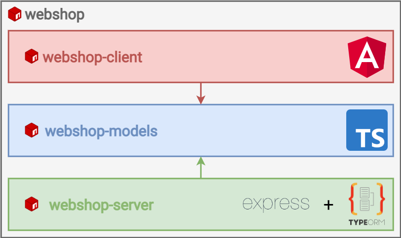

# Monorepo projekt létrehozása
A monorepo (vagy monolithic repository) egy olyan szoftvertervezési megközelítés, amelyben egyetlen központi kódtárban tárolják az összes szoftverfejlesztéshez szükséges forrásfájlt, dokumentációt és konfigurációs álományt. Ezzel szemben a hagyományos megközelítés a multi-repo, amelyben minden projektnek külön repository-ja van.

A monorepo előnyei közé tartozik az egyszerűbb kód megosztás, a könnyebb újrafelhasználhatóság és a könnyebb verziókezelés. Több projektből álló szoftveralkalmazások esetén a monorepo lehetővé teszi, hogy az összes projektet és modult egyszerre kezeljék, ami megkönnyíti az összetett funkciók integrálását és a függőségek kezelését. Azonban nagyon nagy projektek esetén a monorepo nehezebben kezelhetővé válhat, és gyakran [jelentős infrastrukturális kihívásokkal jár](https://qeunit.com/blog/how-google-does-monorepo/).

## A webshop alkalmazás felépítése
A saját monorepo-nkat [NPM Workspaces](https://docs.npmjs.com/cli/v9/using-npm/workspaces?v=true) segítségével fogjuk menedzselni. Ez azt jelenti, hogy lesz egy központi NPM csomagunk, melyben további, önálló NPM csomagokat (workspace-eket) kezelünk.

A következő képen látható projekt struktúra létrehozása a cél.



A központi `webshop` csomag fogja össze az önálló projektjeinket:
- a `webshop-client` csomag az alkalmazás kliensoldali részét tartalmazza,
- a `webshop-server` csomag az alkalmazás szerveroldali részét tartalmazza,
- a `webshop-models` csomag a kliens és a szerver közötti adatcsere struktúráját leíró interfészeket tartalmaz.

Mint az ábrán is látható, a `webshop-models` csomag mind a kliens-, mind a szerveroldalnak függősége.

## Projekt létrehozása

0. Amennyiben még nem tettük meg, rendszerszinten telepítsük a következő csomagokat: `npm install typeorm typescript ts-node ts-node-dev -g`
1. Tetszőleges helyen hozzunk létre a projektnek egy mappát, és nyissuk azt meg: `mkdir webshop && cd webshop`
2. Inicializáljuk az NPM csomagot: `npm init`
3. Hozzuk létre a kliensoldal kódját tároló csomagot: `ng new webshop-client`
    ```
    ? Would you like to add Angular routing? Yes
    ? Which stylesheet format would you like to use? CSS
    ```
4. Hozzuk létre a szerveroldal kódját tároló csomagot:
    - hozzunk létre egy TypeORM projektet: `typeorm init --name webshop-server --database mysql`
    - nyissuk meg a létrehozott mappát: ` cd webshop-server`
    - telepítsük az Express.js-t: `npm install express`
    - telepítsük a szükséges típusokat: `npm install @types/node @types/express --save-dev`
    - a `webshop-server/package.json` fájlban lévő `ts-node` parancsot módosítsuk `ts-node-dev`-re. Így kódváltoztatás esetén a szerverünk automatikusan újra fog indulni.
5. Hozzuk létre az adatcserét leíró interfészeket tároló csomagot! Ehhez egy klasszikus TypeScript-projektet kell inicializálnunk:
    - projekt mappa létrehozása és megnyitása: `mkdir webshop-models && cd webshop-models`
    - NPM csomag inicializálása: `npm init`
    - TypeScript compiler beállításainak létrehozása: `tsc --init`
6. Következő lépésként a 3 létrehozott csomagot workspace-ekként hozzá kell rendelnünk a központi `webshop` csomaghoz:
    - nyissuk meg a `webshop` mappát VSCode-ban!
    - az itt található `package.json` fájlba másoljuk be a következőket:
        ```json
        {
            "name": "webshop",
            "version": "1.0.0",
            "description": "",
            "main": "index.js",
            "workspaces": [
                "./webshop-models",
                "./webshop-client",
                "./webshop-server"
            ],
            "scripts": {
                "start:client": "npm run start -w webshop-client",
                "start:server": "npm run start -w webshop-server"
            },
            "author": "",
            "license": "ISC"
        }
        ```

        Ezzel egyrészt a központi `webshop` csomagban regisztráljuk a workspace-einket, másrészt a fő projektből elérhetővé tesszük az `npm run start:client` és `npm run start:server` parancsokat a megfelelő szoftverkomponensek elindításához.

    - a `webshop` mappából futtassuk az `npm install` parancsot, így érvényesítve a módosításokat.

## Elkészített projekt

Az elkészült projekt [letölthető innen](https://raw.githubusercontent.com/aron123/infrend-2023/master/assets/webshop-init-cs10.zip). A függőségek telepítéséhez az `npm install` parancsot futtatni kell a kitömörített mappából.